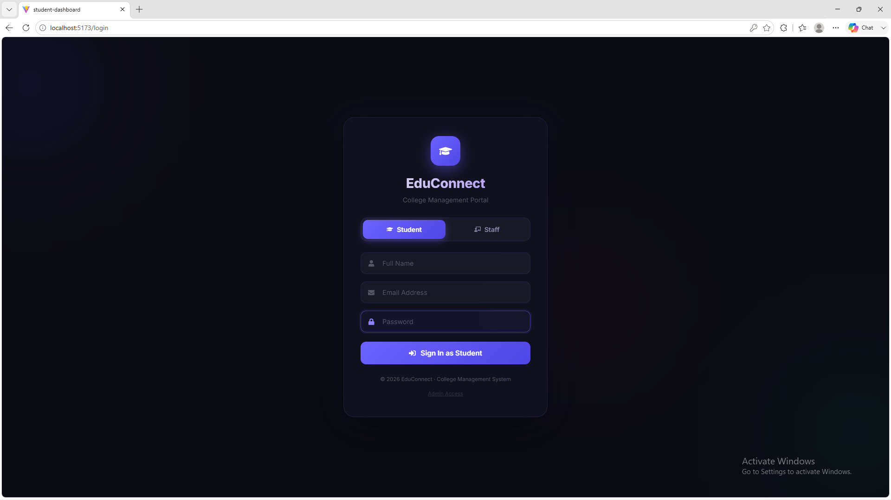
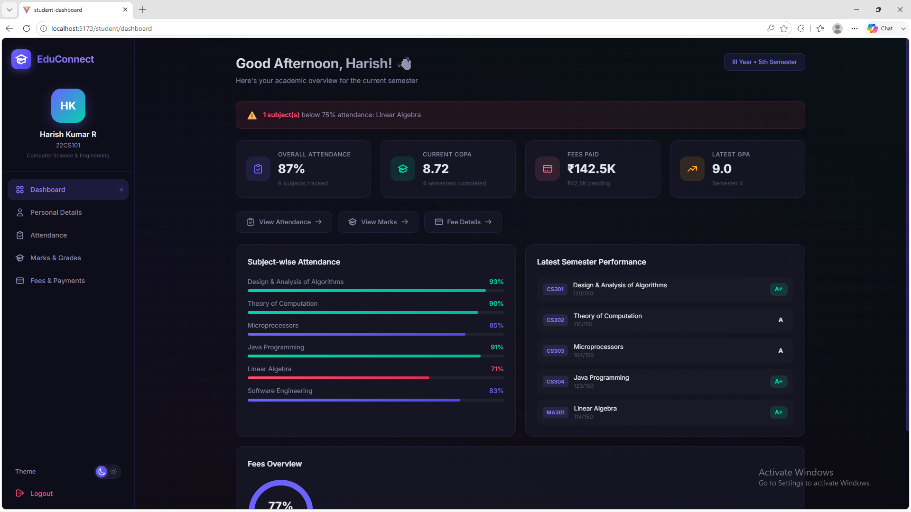
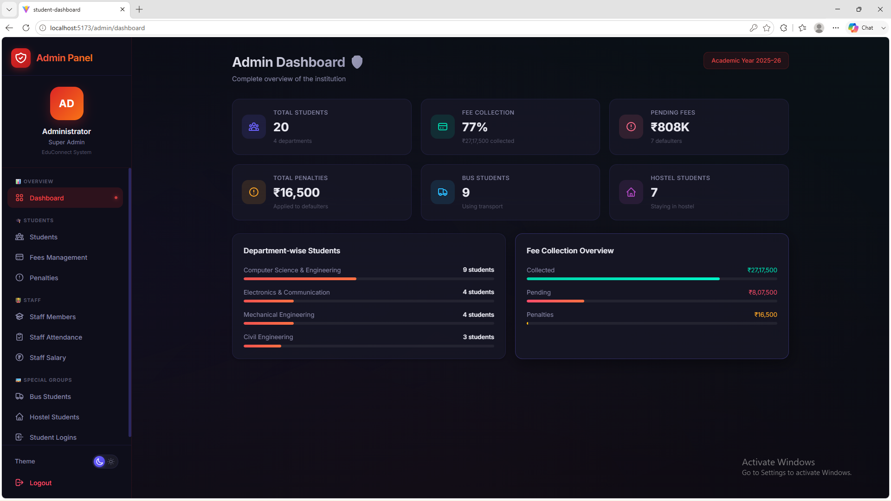

# 🎓 College Management System — Frontend

A modern and responsive **College Management System frontend** built with **React.js** to provide a simple and user-friendly interface for managing student, staff, and administrative activities.

The project focuses on creating a clean dashboard experience with separate interfaces for different users and making college-related information easier to manage and access.

---

## 🚀 Features

### 👨‍🎓 Student

* 🔐 Student Login
* 📊 Student Dashboard
* 📅 View Attendance
* 📝 View Marks
* 💰 View Fee Details
* 👤 View Profile
* 📱 Responsive Interface

### 👨‍🏫 Staff

* 🔐 Staff Login
* 📊 Staff Dashboard
* 👨‍🎓 View Student Information
* 📅 Manage/View Attendance
* 📝 Manage/View Marks
* 👤 Staff Profile

### 👨‍💼 Admin

* 🔐 Admin Login
* 📊 Admin Dashboard
* 👨‍🎓 Student Management
* 👨‍🏫 Staff Management
* 📚 Course/Department Management
* 💰 Fee Management
* 📊 College Overview

---

## 🛠️ Technologies Used

| Technology      | Purpose                     |
| --------------- | --------------------------- |
| ⚛️ React.js     | Frontend development        |
| 🌐 HTML5        | Page structure              |
| 🎨 CSS3         | Styling & responsive design |
| ⚡ JavaScript    | Application logic           |
| 🔗 REST API     | Data communication          |
| 🎯 React Router | Client-side routing         |
| 🧰 Git & GitHub | Version control             |
| 💻 VS Code      | Development environment     |

---

## 📂 Project Structure

```text
college-management-system/
│
├── public/
│
├── src/
│   ├── assets/
│   │
│   ├── components/
│   │   ├── Navbar/
│   │   ├── Sidebar/
│   │   ├── Footer/
│   │   └── Cards/
│   │
│   ├── pages/
│   │   ├── Login/
│   │   ├── Student/
│   │   ├── Staff/
│   │   └── Admin/
│   │
│   ├── hooks/
│   │
│   ├── services/
│   │
│   ├── App.jsx
│   ├── main.jsx
│   └── index.css
│
├── package.json
└── README.md
```

---

## 🎯 User Roles

```text
                    College Management System
                              │
             ┌────────────────┼────────────────┐
             │                │                │
          Student            Staff            Admin
             │                │                │
       ┌─────┼─────┐     ┌────┼────┐      ┌────┼─────┐
       │     │     │     │    │    │      │    │     │
    Marks  Fees  Attend  Marks Attend  Students Staff Fees
```

---

## 📊 Student Dashboard

The student dashboard provides quick access to important academic information.

### Available Modules

* 📊 Dashboard
* 📅 Attendance
* 📝 Marks
* 💰 Fees
* 👤 Profile
* 🔔 Notifications

---

## 👨‍🏫 Staff Dashboard

Staff members can access student-related information and academic management features.

### Available Modules

* 📊 Dashboard
* 👨‍🎓 Students
* 📅 Attendance
* 📝 Marks
* 👤 Profile

---

## 👨‍💼 Admin Dashboard

The admin dashboard provides an overview of the college management system.

### Available Modules

* 📊 Dashboard
* 👨‍🎓 Students
* 👨‍🏫 Staff
* 📚 Departments
* 💰 Fees
* 📈 Reports
* ⚙️ Settings

---

## 🎨 UI & Design

The application is designed with a focus on:

* 📱 Responsive design
* 🧩 Reusable React components
* 🎯 Simple navigation
* ✨ Clean dashboard layouts
* 🖥️ Desktop and mobile compatibility
* 🎨 Consistent UI components
* ⚡ Smooth user experience

---

## 🔑 Authentication Flow

```text
                  Login Page
                      │
                      ▼
              Select User Role
                      │
          ┌───────────┼───────────┐
          ▼           ▼           ▼
       Student       Staff       Admin
          │           │           │
          ▼           ▼           ▼
      Student      Staff       Admin
     Dashboard   Dashboard   Dashboard
```

---

## ⚙️ Installation

### 1. Clone the repository

```bash
git clone https://github.com/your-username/college-management-system.git
```

### 2. Navigate to the project

```bash
cd college-management-system
```

### 3. Install dependencies

```bash
npm install
```

### 4. Start the development server

```bash
npm run dev
```

The application will run locally using the development server.

---

## 📸 Screenshots
### Login Page

### Student Dashboard

### Admin Dashboard



---

## 📚 What I Learned

Through this project, I gained practical experience in:

* Building applications with React.js
* Creating reusable components
* Managing application state
* Implementing client-side routing
* Creating responsive layouts
* Designing dashboard interfaces
* Working with REST APIs
* Structuring a real-world frontend project
* Using Git and GitHub for version control

---

## 🔮 Future Improvements

* 🔐 Complete authentication system
* 🔗 Backend integration
* 🗄️ Database integration
* 📊 Advanced analytics and reports
* 🔔 Real-time notifications
* 📱 Mobile application
* 🌙 Dark mode
* 📄 PDF report generation

---

## 👨‍💻 Developer

**Ponraj K**

💻 Full-Stack Developer | MERN Stack Developer | React.js Developer

📧 **Email:** [ponrajk2006@gmail.com](mailto:ponrajk2006@gmail.com)

💼 **LinkedIn:** [Connect with me](https://www.linkedin.com/in/ponraj-k-481213359/)

🌐 **Portfolio:** [Visit Portfolio](https://ponraj.netlify.app/)

---

## ⭐ Support

If you like this project, consider giving it a ⭐ on GitHub.

**🚀 Learn • Build • Improve • Repeat**
